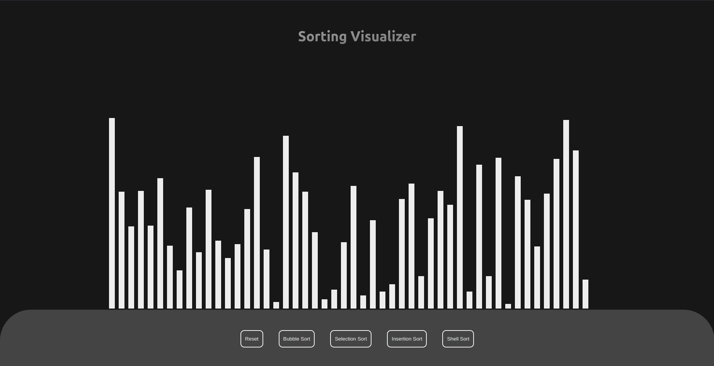
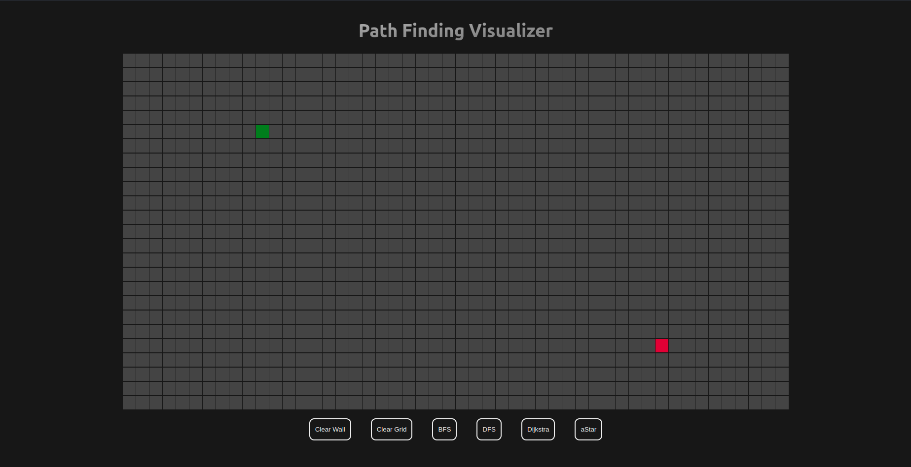

# Algo-Visualizer

Algorithm Visualizer is an interactive way and platform that visualize the algorithms in two domain i.e. Path Finding and Sort Visual algorithm. The project focuses on visualizng the algorithm and try to make easier to understand and learn the algorithm.

## Visualizations
The following visualizations are available currently

- Bubble Sort
- Selection Sort
- Insertion Sort
- Shell Sort
- Dijsktra's path finding algorithm
- A* algorithm
- BFS (breadth first search)
- DFS (depth first search)

## Screenshots

## Setup

Make sure you have npm already installed

1. Clone this repository : `git clone https://github.com/vishalda/Algo-visualizer.git`
2. Move into the directory: `cd Algo-visualizer`
3. Install packages: `npm install`
4. Run the project: `npm start`